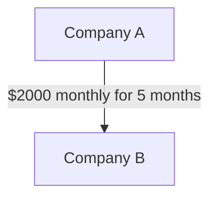

# python
visualizes and breaks down contracts
# Contract AI Analyzer

**Contract AI Analyzer** is a full-stack AI-powered web application that reads legal contracts (PDF or text), simplifies them, and visually maps out the flow of money described in the contract. Built with React, FastAPI, and OpenAI GPT-4.

---

## 🧠 Features

- Upload or paste a legal contract
- Automatically summarizes key terms
- Extracts payment obligations
- Visualizes who pays whom, how much, and on what schedule
- Exports the diagram as an SVG image

---

## ⚙️ Tech Stack

- **Frontend**: React (with Tailwind, ShadCN, Mermaid.js)
- **Backend**: FastAPI (Python)
- **AI Engine**: OpenAI GPT-4 via API
- **PDF Parsing**: `pdfjs-dist`

---

## 🚀 Getting Started

### 1. Clone the Repository

```bash
git clone https://github.com/yourusername/contract-ai-analyzer.git
cd contract-ai-analyzer
```

### 2. Install Frontend

```bash
cd contract_ai_site
npm install
npm run dev
```

### 3. Install Backend

```bash
cd backend
python -m venv venv
source venv/bin/activate  # On Windows: venv\Scripts\activate
pip install -r requirements.txt
```

Create a `.env` file in `backend/` and add:

```bash
OPENAI_API_KEY=your_openai_key_here
```

Then run:

```bash
uvicorn main:app --reload
```

> The backend will be running at `http://localhost:8000`

---

## 📄 Example JSON Output

```json
{
  "summary": "This contract outlines payment of $10,000 from Company A to Company B for software development services over a 5-month period.",
  "flows": [
    {
      "payer": "Company A",
      "payee": "Company B",
      "amount": "2000",
      "schedule": "monthly for 5 months"
    }
  ]
}
```

---

## 🖼 Diagram Example

Generated using Mermaid.js:



---

## 🐳 Running with Docker

If you have Docker installed:

```bash
docker-compose up --build
```

- Backend: http://localhost:8000
- Frontend: http://localhost:5173

Add your OpenAI API key in `backend/.env` like this:

```env
OPENAI_API_KEY=your_openai_key_here
```

---

## 🛠 Todo / Improvements

- Add OCR for image-based PDFs
- Handle contract sections (clauses, termination, liability)
- Deploy frontend + backend to Vercel/Fly.io

---

## 📄 License

MIT License

---

## 👤 Author

Created by [Your Name]. Contributions welcome!
